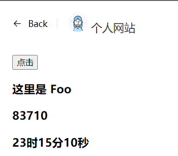
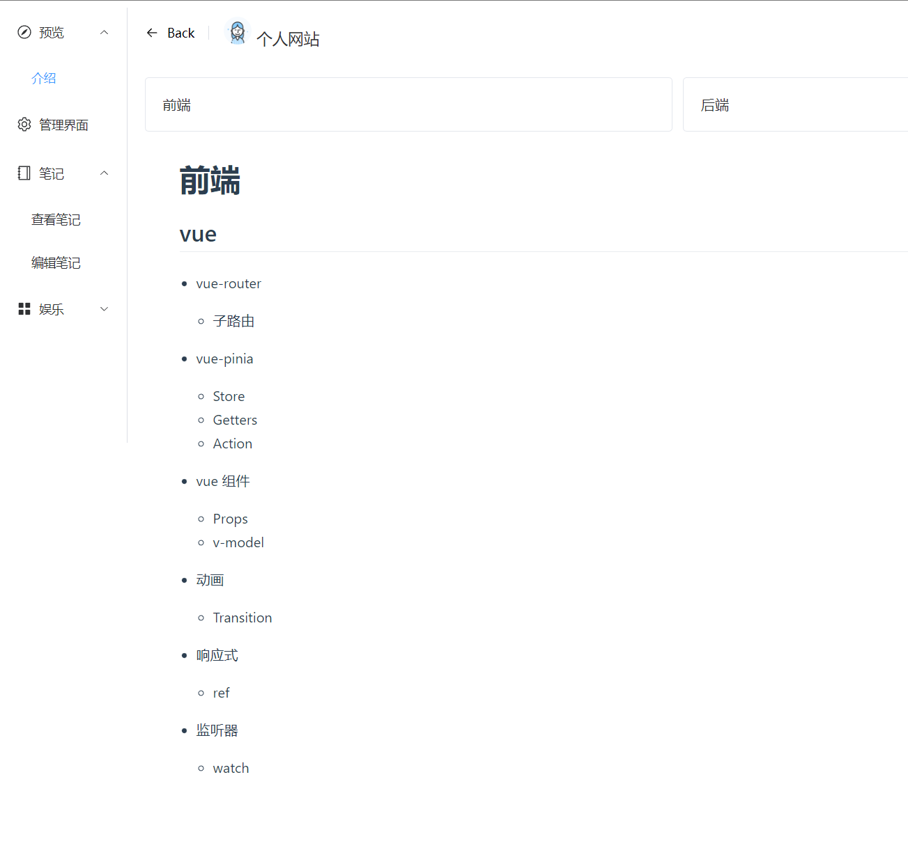
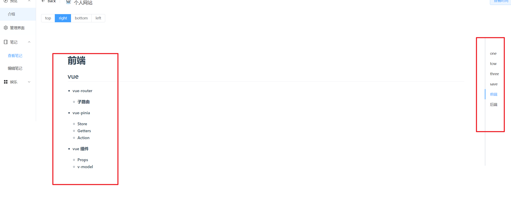
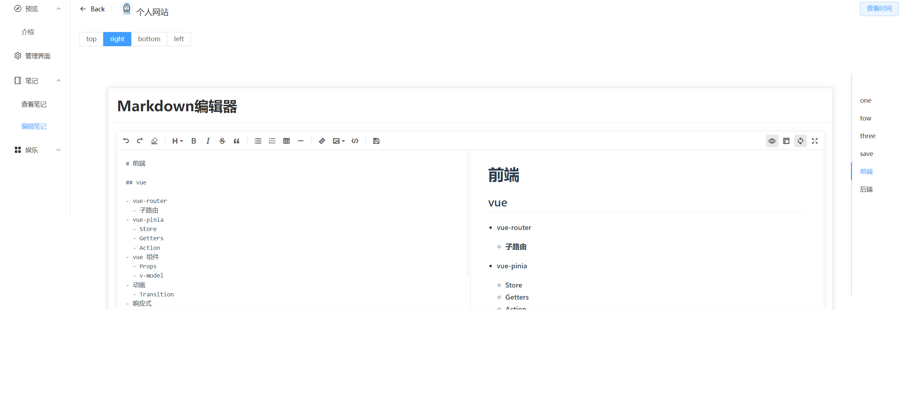

# big-course

## 项目启动
```
npm install
```

### 编译并且开发热加载
```
npm run serve
```

### 编译和项目最小化
```
npm run build
```

### 项目介绍
这个项目包含后端，用到的是springboot和mongodb
**如果只有前端是没办法运行的**

####  前端
**用到的技术**
- vue-router
    - 子路由
- vue-pinia
    - Store
    - Getters
    - Action
- vue 组件
    - Props
    - v-model
- 动画
    - Transition
- 响应式
    - ref
- 监听器
    - watch
    

> 用pinia创建的获取时间功能 


> 查看前端和后端用到的技术


> 查看用户的所有文档


> 可以对用户的所有文档进行编辑
